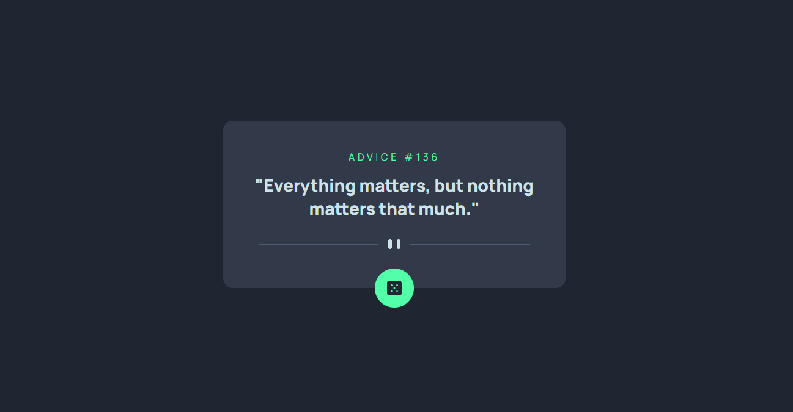
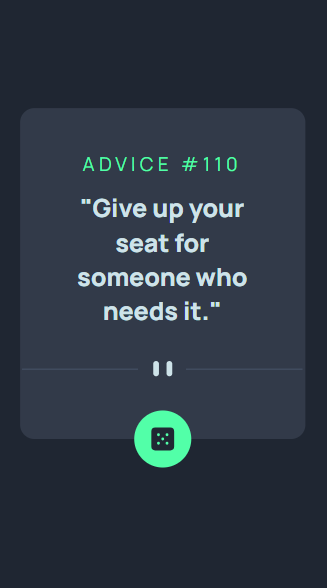

# Gerador-de-conselhos

Este projeto é um desafio do [Frontend Mentor](https://www.frontendmentor.io/challenges/advice-generator-app-QdUG-13db) que consiste em criar um gerador de conselhos utilizando a  API Advice Slip, fornecendo conselhos aleatórios aos usuários.

## Layout Desktop    

 

## Layout Mobile    

## Tecnologias utilizadas

- HTML
- CSS
- JS

Para ver o projeto pronto [clique aqui ](https://gerador-de-conselhos-five.vercel.app/)

## ❤️ Contato
claudiacostapaniago@gmail.com
